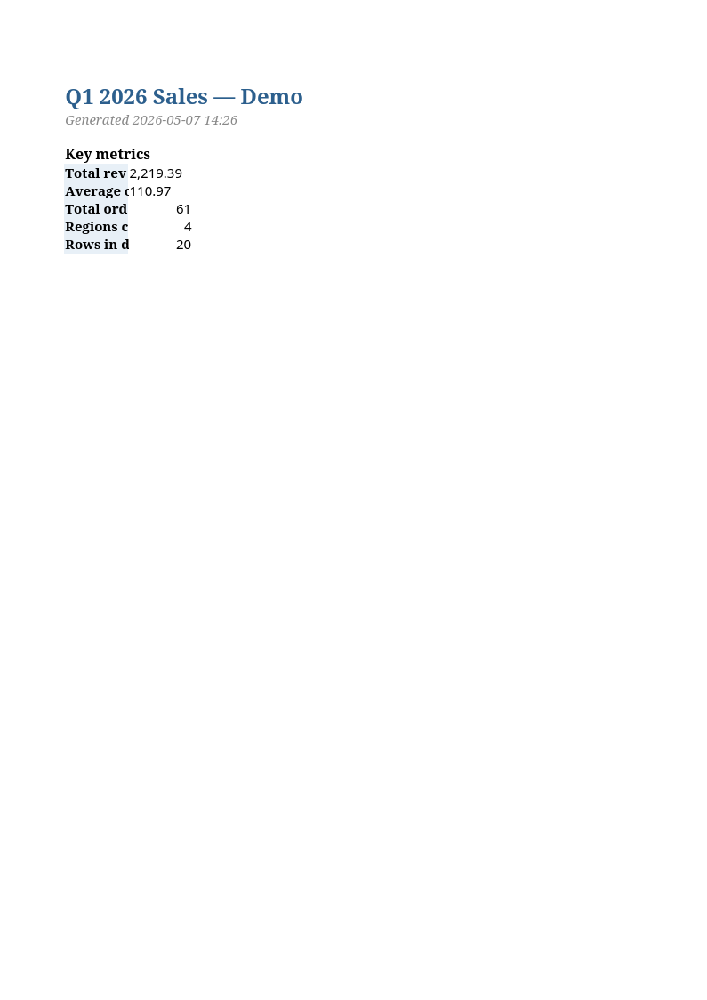

# Nordikdata — Portfolio

Three small, working examples of the kind of work I deliver.

Each is self-contained — clone, install requirements, run.

## Showcases

### [scraper-demo/](scraper-demo/)
Production-shape web scraper with retries, dedup, SQLite storage, CSV/JSON export. Two public sources: Hacker News front page and GitHub Trending. Demonstrates the patterns I use on real client jobs.

### [excel-report/](excel-report/)
CSV → branded multi-sheet XLSX report with KPIs, conditional formatting, pivot summary, and charts. The deliverable I build for clients with raw export data who want a polished workbook.

### [claude-classifier/](claude-classifier/)
Batch-classify any CSV column with the Claude API. Built-in cost cap, token tracking, resume support. ~0,05 € to classify 1000 product reviews with Sonnet 4.5.

## What I do

Data engineering and automation, fixed-price.

- Python scripting: scrapers, automation, data pipelines, file processing, API integrations
- Data analysis: pandas, numpy, statistical work, reports
- Excel and Google Sheets: complex formulas, VBA, Apps Script, dashboards
- SQL: query writing, optimization, schema design, scheduled extracts
- Web scraping: BeautifulSoup, Playwright, Selenium, structured extraction at scale
- AI integrations: Claude API, OpenAI, RAG with vector DBs

Typical project sizes: small scripts $50-150, analysis reports $100-350, full pipelines $300-1000.

## Hire me

Email: Nordikdata@proton.me
Freelancer.com: [u/nordikdata](https://freelancer.com/u/nordikdata)
Reddit: [u/nordikdata](https://reddit.com/u/nordikdata)
GitHub: [Nordikdata](https://github.com/Nordikdata)
