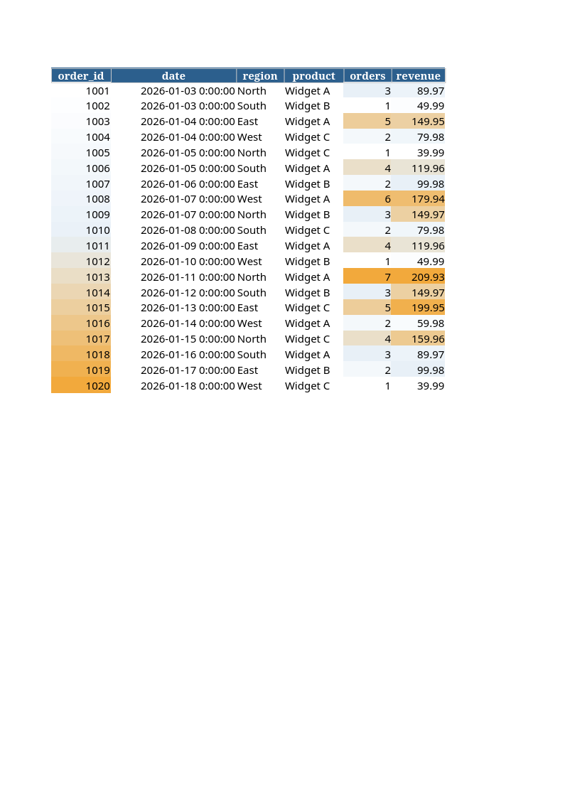
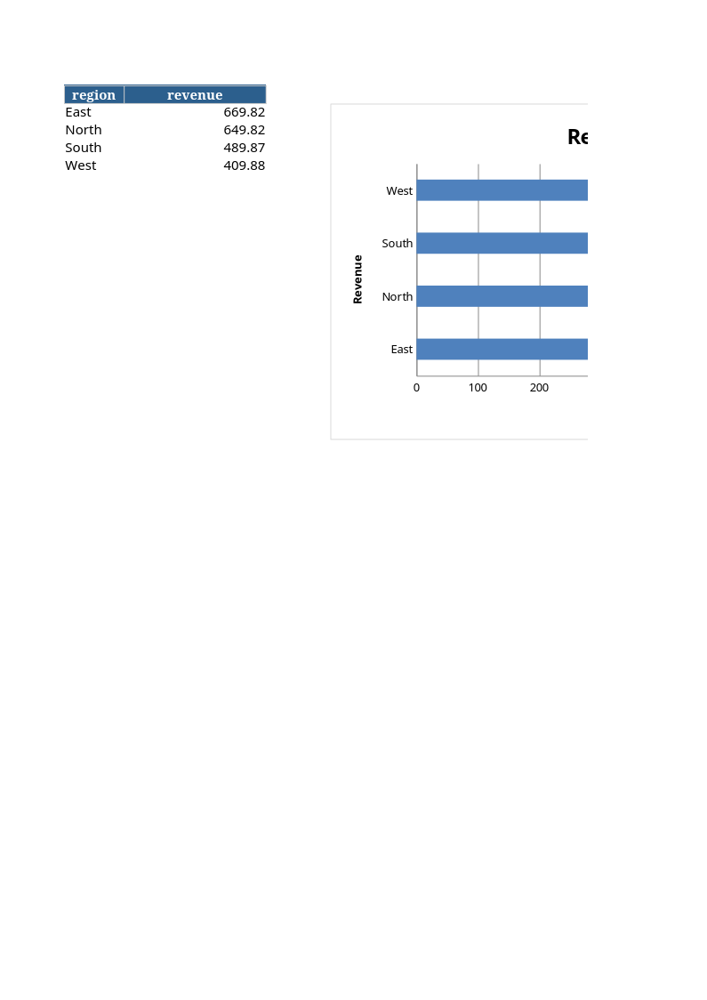
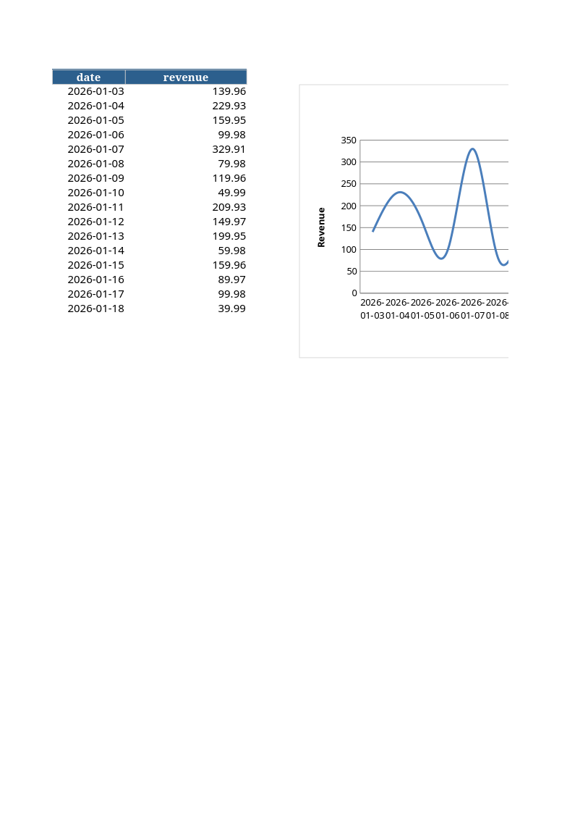

# Excel Report Automation

CSV in → branded XLSX report out, with KPIs, conditional formatting, pivot summary, and charts.

The kind of deliverable I build for clients who have raw export data and want a polished, share-ready workbook.

## What you get

A multi-sheet workbook:

1. **Summary** — title, generation timestamp, KPI block (totals, averages, region count)
2. **Data** — full dataset with sticky header, conditional color scale on numeric columns
3. **By region** — pivot table with bar chart
4. **Daily revenue** — time series line chart

All branded with your colors (configurable in `report.py`).

## Preview

Generated from `sample/sales.csv` (20 orders) — what your boss actually sees when they open the workbook:

| Sheet | Preview |
| --- | --- |
| Summary (KPIs) |  |
| Data (conditional formatting) |  |
| By region (pivot + bar chart) |  |
| Daily revenue (line chart) |  |

The actual file is in [sample/report.xlsx](sample/report.xlsx) — open it in Excel to see formatting, formulas, and live charts.

## Quick start

```bash
pip install pandas openpyxl

python report.py \
    --input sample/sales.csv \
    --output report.xlsx \
    --title "Q1 2026 Sales"

# Opens in Excel, LibreOffice, or Numbers
```

## Sample input (`sample/sales.csv`)

```csv
order_id,date,region,product,orders,revenue
1001,2026-01-03,North,Widget A,3,89.97
1002,2026-01-03,South,Widget B,1,49.99
...
```

## What you get when you hire me

I have built Excel automations from one-off cleanup scripts to full reporting pipelines that run every morning. For your case I would either use pandas plus openpyxl for full control, or Apps Script if it has to live inside Google Sheets, or VBA for legacy Excel environments.

Send me a sample of the input file plus an example of the expected output, I will reply with a fixed price within hours.

## Hire me for similar work

Contact: Nordikdata@proton.me
Profiles: Freelancer.com/u/nordikdata · Reddit u/nordikdata

Typical project sizes: cleanup scripts ($50-150), report automation ($150-400), full pipelines ($400-1000).
